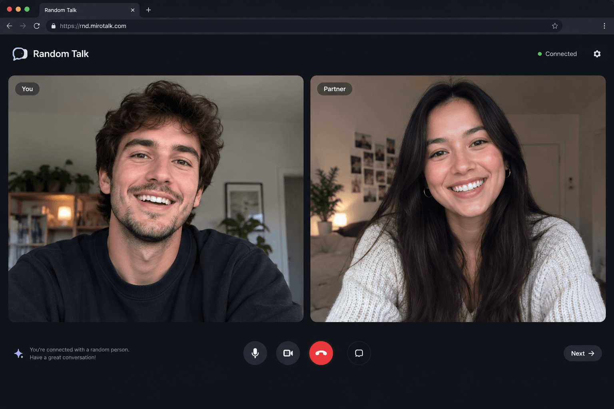

<h1 align="center">MiroTalk RND</h1>

<p align="center">
  <a href="https://rnd.mirotalk.com">
    
  </a>
</p>

<p align="center"><em>Meet someone random. Talk instantly.</em></p>

<p align="center">Random 1-on-1 video chat built with Node.js, Socket.IO, and WebRTC.</p>

<p align="center">
  <a href="https://rnd.mirotalk.com">Live demo</a> •
  <a href="#-what-it-does">Features</a> •
  <a href="#-quick-start">Quick Start</a> •
  <a href="#-docker">Docker</a> •
  <a href="#configuration-env">Configuration</a>
</p>

---

## ✨ What it does

- Random peer matching
- Video/audio chat over WebRTC
- Next match + end session
- Mic/camera toggle + hide self preview
- Device selection
- Virtual background support (blur and image)
- Sound cues for waiting, connected, incoming message, and partner left (can be turned off in settings)
- Queue, capacity, and anti-spam limits
- Text chat with your current partner (relayed through the server, not stored)
- Report button with automatic temporary IP bans (configurable)
- Can match users across multiple servers (optional)
- Mobile-friendly UI

## 🚀 Quick start

```bash
cd mirotalkrnd
cp .env.template .env
npm install
npm start
```

Then open: `http://localhost:4010`

> In production, use HTTPS for camera/microphone permissions.

## 🐳 Docker

```bash
cp .env.template .env
cp docker-compose.template.yml docker-compose.yml
docker compose pull
docker compose up -d
```

Then open: `http://localhost:<PORT>` (default `4010`).

## 🛠️ Installer script (Ubuntu)

```bash
sudo ./install.sh
```

The installer supports:

- Docker setup (with official image `mirotalk/rnd:latest` or local build)
- Local Node.js setup

<a id="configuration-env"></a>

## ⚙️ Configuration (`.env`)

Edit `.env` for your needs use [.env.template](.env.template) as reference, then restart the server.

## 📚 Documentation

- [Configurations](https://docs.mirotalk.com/mirotalk-rnd/configurations/)
- [Self-hosting](https://docs.mirotalk.com/mirotalk-rnd/self-hosting/)
- [Integration](https://docs.mirotalk.com/mirotalk-rnd/integration/)
- [Metrics](https://docs.mirotalk.com/mirotalk-rnd/metrics/)

## 📜 Scripts

- `npm start` — start server
- `npm run dev` — run with watch mode
- `npm test` — run tests (set `TEST_REDIS_URL=redis://localhost:6379` to also run the two-instance Redis tests)

## License

This project is licensed under the GNU Affero General Public License v3.0.
See [LICENSE](./LICENSE).

---

<p align="center">
  🌐 Explore the full MiroTalk suite (SFU, P2P, BRO, C2C, WEB, CME, ADM) → <a href="https://docs.mirotalk.com/sites/overview/">MiroTalk Overview</a>
</p>

<p align="center">
  Built with ❤️ by <a href="https://www.linkedin.com/in/miroslav-pejic-976a07101/">Miroslav</a> and the open-source community.
</p>
